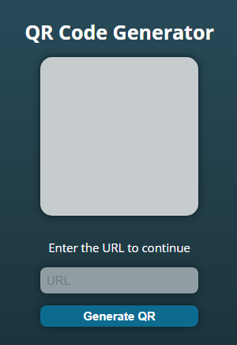

# QRCode_Generator

A simple web page to generate a QR code with the URL of a website.

## How to use

- Enter to the website, click [here](https://pedrohiguerag.github.io/QRCode_Generator/)
- This is the main interface:

  

- Enter the corresponding link and click in "Generate QR":

  

- This is the final result:

  

- If you want download de QR code, click in "Download QR"
